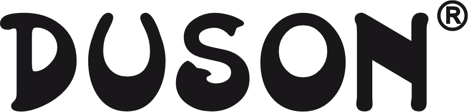

<link rel="stylesheet" type="text/css" media="all" href="custom/style.css" />
# Duson
#### Creative Park Client

---
### Website Information

duson-logo-type1-dark

## Wordpress Development
### Credentials (v.1)

**Date of creation:**  
6/15/17

**Access URL:**  
duson.com.py

**Username**  
`duson_ad`

**Password**  
`28hhfdaoY1`

**Email**  
jan@creativepark [needs to be modified]

---

| Database Stats                 | Data         |
| :----------------------------- | :----------- |
| Database name                  | wp968        |
| Table Prefix                   | wp4m_        |
| Disable Update Notifications   | No           |
| Auto Upgrade                   | No           |
| Auto Upgrade WordPress Plugins | No           |
| Auto Upgrade WordPress Themes  | No           |
| Automated backups              | Don't backup |
| Backup Rotation                | —            |

---

| Wordpress Settings   | Data    |
| :------------------- | :------ |
| Language             | Spanish |
| Limit Login Attempts | Yes     |

---

### Duson cPanel Access

**Dominio:**                                             `duson.com.py`

**Acceso cPanel:**
`cpanel.duson.com.py`

**IP Address:**                                       `184.107.229.218`

---

**User:**
`duson`

**Contraseña:**
`qg5cQR4MVkfV`

**Servidor de nombres 1:**
`ns1.adosmdos.com`

**Servidor de nombres 2:**
`ns2.adosmdos.com`

### Content

#### Descripción breve 

Duson es una compañía fabricante de útiles escolares y de oficina. La primera y única empresa paraguaya en fabricar bolígrafos, ofrecemos los productos de más alta calidad.

#### Perfil de la empresa 

Somos fabricantes de útiles escolares y de oficina, la primera y única empresa en fabricar bolígrafos en el Paraguay. Tenemos un especial cuidado en nuestros estándares de control de calidad, porque cuidamos a nuestros clientes ofreciendo la mayor calidad en nuestros productos.

#### Misión 

Brindar un servicio de alta calidad destinado a satisfacer las necesidades de los clientes a través de la comercialización y distribución de artículos de oficina, útiles escolares  y merchandinsing de los mismos productos, contando con personal debidamente capacitado, con una infraestructura acorde a lo ofrecido para así poder lograr la satisfacción de nuestros clientes.

#### Visión 

Ser una empresa con una buena estructura para poder brindar a los clientes la mejor atención, mantener nuestras marcas en el mercado en especial Duson que con su trayectoria nos ha llevado a contar con una cuota de mercado importante.
Hacer rentable el trabajo en todos los ámbitos y así también brindar un desarrollo integral a nuestros colaboradores.

#### Valores 

Calidad: Estamos comprometidos con un proceso de mejoramiento continuo, logrando con ello mayor productividad.
Transparencia: Las acciones de la empresa son respetuosas de las normas y leyes establecidas e implican procedimientos honrados y explícitamente claros que garantizan la legalidad de los mismos

**Teléfono:** 
595-21-301-228/30

**Sitio web:** 
www.duson.com.py

**Consultas y Pedidos:** 
info@duson.com.py 